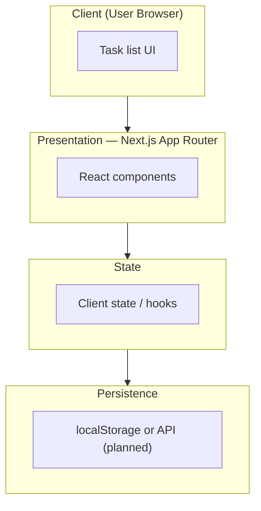
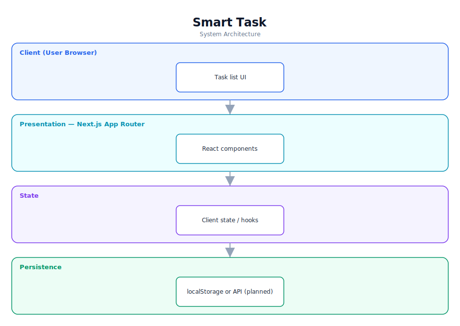

# Smart Task — Software Documentation

> A task-management web app built with Next.js (early scaffold).

**Repository:** [`smart-task`](https://github.com/Monametsi-s/smart-task)  
**Type:** Web application  
**Status:** Early scaffold

---

## 1. Overview

Smart Task is a task-management web application scaffolded with Next.js and TypeScript. The repository currently carries the default starter README, so its precise feature set is not documented; this document describes a sensible target architecture for a task manager built on this stack.

## 2. System Architecture

The diagram below shows the high-level architecture and how data flows between layers. It renders automatically on GitHub (Mermaid) and is also committed as a vector image ([`architecture.svg`](architecture.svg)).



<p align="center"></p>

### 2.1 Component responsibilities

| Layer | Responsibility |
|---|---|
| **Client** | Lets users create and manage tasks. |
| **Presentation (Next.js)** | App Router pages and components. |
| **State** | Client-side state management for tasks. |
| **Persistence** | Local storage now; a backend API is a natural extension. |

## 3. Technology Stack

| Area | Technology |
|---|---|
| Framework | Next.js (App Router) |
| Language | TypeScript |
| Styling | Tailwind CSS (assumed) |

## 4. Assumed User Requirements

_These requirements are inferred from the project's purpose and feature set; they document the intended behaviour rather than a formally agreed specification._

### 4.1 Functional requirements

- **FR-01** — Create tasks.
- **FR-02** — Mark tasks complete.
- **FR-03** — Edit and delete tasks.
- **FR-04** — Filter or sort tasks.
- **FR-05** — Persist tasks between sessions.

### 4.2 Representative user stories

- As a user, I want to capture tasks quickly.
- As a user, I want to track which tasks are done.
- As a user, I want my tasks to persist.

### 4.3 Non-functional requirements

- The UI must be responsive.
- Task state must persist across reloads.
- The codebase should remain typed and maintainable.

## 5. Assumed System Requirements

### 5.1 End-user (runtime) requirements

- A modern desktop or mobile web browser (latest Chrome, Edge, Firefox, or Safari) with JavaScript enabled.
- A stable internet connection for the initial page load.

### 5.2 Server / hosting requirements

- A Node-compatible host for Next.js (only if a backend is added).

### 5.3 External services & API keys

- None — the application has no third-party service dependencies at runtime.

### 5.4 Developer / build requirements

- Node.js 18+ and npm (or yarn/pnpm).
- Git for cloning the repository.
- A code editor such as VS Code (recommended).

## 6. Data Model

Tasks as { id, title, completed, createdAt }; storage mechanism to be confirmed (localStorage or API).

## 7. Setup & Installation

```bash
git clone https://github.com/Monametsi-s/smart-task.git
cd smart-task
npm install
npm run dev
```

## 8. Assumptions & Future Considerations

- Write a real README describing the feature set.
- Confirm and document the persistence approach.
- Add a screenshot and a live demo.

---

<sub>This document was generated as part of a portfolio-wide documentation pass. User and system requirements are **assumed** from the codebase, README, and project intent, and should be validated against real product goals before being treated as authoritative.</sub>
